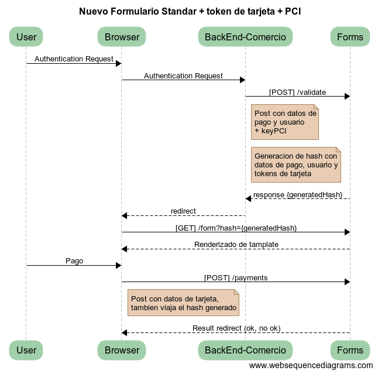

<a name="inicio"></a>
Decidir SDK .Net
===============

Modulo para conexión con gateway de pago DECIDIR2

  + [Introducción](#introduccion)
	+ [Alcance](#alcance)
	+ [Pasos para realizar un pago al nuevo formulario](#Pasos)
	+ [Diagrama de secuencia](#secuencia)
  + [Instalación](#instalacion)
    + [Versiones de .Net soportadas](#versionesdenetsoportadas)
	+ [Manual de Integración](#manualintegracion)
	+ [Ambientes](#test)
  + [Uso](#uso)
    + [Inicializar la clase correspondiente al conector](#initconector)
    + [Operatoria del Gateway](#operatoria)
      + [Health Check](#healthcheck)
      + [Ejecución del Pago](#payment)
      + [Listado de Pagos](#getallpayments)
      + [Información de un Pago](#getpaymentinfo)
      + [Anulación / Devolución Total de Pago](#refund)
      + [Anulación de Devolución Total](#deleterefund)
      + [Devolución Parcial de un Pago](#partialrefund)
      + [Anulación de Devolución Parcial](#deletepartialrefund)
    + [Tokenización de tarjetas de crédito](#tokenizaciontarjeta)
      + [Listado de tarjetas tokenizadas](#listadotarjetastokenizadas)	
      + [Solicitud de token de pago](#solicitudpagotokenizado)
      + [Ejecución de pago tokenizado](#pagotokenizado)
      + [Eliminación de tarjeta tokenizada](#eliminartarjetatokenizada)
    + [Integración con Cybersource](#cybersource)
      + [Parámetros Comunes](#parametros-comunes)
      + [Retail](#retail)
      + [Ticketing](#ticketing)
      + [Digital Goods](#digital-goods)  
  + [Tablas de referencia](#tablasreferencia)
    + [Códigos de Medios de Pago](#codigos-de-medios-de-pago)
      + [Divisas Aceptadas](#divisasa)
    + [Provincias](#provincias)
  
<a name="introduccion"></a>

## Introducción
El flujo de una transacción a través de las **sdks** consta de dos pasos, la **generaci&oacute;n de un token de pago** por parte del cliente y el **procesamiento de pago** por parte del comercio. Existen sdks espec&iacute;ficas para realizar estas funciones en distintos lenguajes que se detallan a continuaci&oacute;n:

+ **Generaci&oacute;n de un token de pago.**  Se utiliza alguna de las siguentes **sdks front-end** :
  + [sdk IOS](https://github.com/decidir/SDK-IOS.v2)
  + [sdk Android](https://github.com/decidir/SDK-Android.v2)
  + [sdk Javascript](https://github.com/decidir/sdk-javascript-v2)
+ **Procesamiento de pago.**  Se utiliza alguna de las siguentes **sdks back-end** :
  + [sdk Java](https://github.com/decidir/SDK-JAVA.v2)
  + [sdk PHP](https://github.com/decidir/SDK-PHP.v2)
  + [sdk .Net](https://github.com/decidir/SDK-.NET.v2)
  + [sdk Node](https://github.com/decidir/SDK-.NODE.v2)

[<sub>Volver a inicio</sub>](#inicio)

<a name="alcance"></a>

### Alcance
La **sdk Net** provee soporte para su **aplicaci&oacute;n back-end**, encargandose de la comunicaci&oacute;n del comercio con la **API Decidir** utilizando su **API Key privada**<sup>1</sup> y el **token de pago** generado por el cliente.

</br>

<a name="Pasos"></a>

### Pasos para realizar un pago al nuevo formulario:


- El comercio que se integre, debe realizar un [POST] al endpoint de Forms /validate

En el header debe enviarse la apikey pci.
El body de dicho post contendrá lo siguiente:
```JSON#
{
"site": {
    "id": "00123123",                                          
    "transaction_id": "0000001111"                    
},
  "customer": {     
    "id": "test",                                                    
    "email" : "cliente@email.com"
  },
"payment": {
   "amount": 99999,
   "currency": "ARS",
   "payment_type": "distributed",
   "sub_payments" : [
    {
        "site_id": "00111116",
          "amount": 60000,           
          "installments": 3             
      },
      {
        "site_id": "00111117",
          "amount": 39999,             
          "installments": 3            
      }
   ]
},
  "success_url": "http://www.ituran.com.ar/home",
  "cancel_url": "http://www.ituran.com.ar/pagos"
}
```

- CAMPO ID (SITE): Dato no requerido.En caso de que ingrese con un site (que viene en la apikey), y quiera realizar un pago con otro site.
- CAMPO TRANSACTION_ID (SITE): Numero de operación.
- CAMPO ID (CUSTOMER): Nombre de usuario registrado en el sitio, dato para obtener tokes de tarjetas.
- CAMPO EMAIL (CUSTOMER): Email donde se enviará información del pago.
- CAMPO AMOUNT (PAYMENT): Es el monto, el mismo viaja como Long.
- CAMPO CURRENCY (PAYMENT): Tipo de moneda.
- CAMPO PAYMENT_TYPE (PAYMENT): Si el pago es simple "single" en cambio si es distribuida como en en ejemplo "distributed".
- CAMPO SUB_PAYMENTS (PAYMENT): Para el caso de un pago simple el mismo debe ir de la siguiente manera: "sub_payments" : [  ]
- CAMPO SUCCESS_URL: Url donde rediccionara una vez realizado el pago con exito.
- CAMPO CANCEL_URL: Url donde rediccionara si el cliente quiere cancelar el formulario.


El resto de la información que no se encuentra en dicho Post, sea los medio de pago o cuotas habilitadas para dicho sitio, se encuentran en el template.

El resultado del validate contendrá un hash de la información enviada. Ejemplo:
{
    "hash": "generatedHash"
}

- Con el hash obtenido, el browser tendrá que ser redirigido con un [GET] al recurso /form?hash={generatedHash} mostrando el template renderizado para hacer el pago.

- El usuario pondrá optar por una tarjeta tokenizada o ingresará los datos de una nueva. Una vez completado el formulario, al seleccionar pagar, este hará un [POST] al enpoint /payments de Forms.
Forms intentará realizar un pago. En caso de que sea satisfactorio, este redirigirá a la página seteada en el campo "success_url" (paso 1), caso contrario renderizará el template de error.


Para generar el token de pago, la aplicaci&oacute;n cliente realizar&aacute; con **Decidir** a trav&eacute;s de alguna de las siguentes **sdks front-end**:
+ [sdk IOS](https://github.com/decidir/SDK-IOS.v2)
+ [sdk Android](https://github.com/decidir/SDK-Android.v2)
+ [sdk Javascript](https://github.com/decidir/sdk-javascript-v2)

</br>

[<sub>Volver a inicio</sub>](#inicio)

<a name="secuencia"></a>

### Diagrama de secuencia

El flujo de una transacción a través de las sdks consta de dos pasos, a saber:

sdk front-end: Se realiza una solicitud de token de pago con la Llave de Acceso pública (public API Key), enviando los datos sensibles de la tarjeta (PAN, mes y año de expiración, código de seguridad, titular, y tipo y número de documento) y obteniéndose como resultado un token que permitirá realizar la transacción posterior.

sdk back-end: Se ejecuta el pago con la Llave de Acceso privada (private API Key), enviando el token generado en el Paso 1 más el identificador de la transacción a nivel comercio, el monto total, la moneda y la cantidad de cuotas.

A continuación, se presenta un diagrama con el Flujo de un Pago.

</br>

[<sub>Volver a inicio</sub>](#inicio)

<a name="instalacion"></a>
## Instalación
Se debe descargar la última versión del SDK desde el botón Download ZIP del branch master.
Una vez descargado y descomprimido, se debe agregar la librería Decidir.dll que se encuentra dentro de la carpeta dist, a las librerías del proyecto y en el codigo se debe agregar siguiente using.

```C#
using Decidir;
using Decidir.Constants;
using Decidir.Model;
using Decidir.Exceptions;
```

<a name="versionesdenetsoportadas"></a>
### Versiones de .Net soportadas
La versi&oacute;n implementada de la SDK, esta testeada para versiones desde .net 3.5

[<sub>Volver a inicio</sub>](#inicio)

<a name="manualintegracion"></a>

### Manual de Integración

Se encuentra disponible la documentación **[Manual de Integración Decidir2](https://decidir.api-docs.io/1.0/guia-de-inicio/)** para su consulta online, en este detalla el proceso de integración. En el mismo se explican los servicios y operaciones disponibles, con ejemplos de requerimientos y respuestas, aquí sólo se ejemplificará la forma de llamar a los distintos servicios utilizando la presente SDK.

[<sub>Volver a inicio</sub>](#inicio)

<a name="test"></a>

### Ambientes

El SDK-Net permite trabajar con los ambientes de desarrollo y de producción de Decidir.
El ambiente se debe instanciar como se indica a continuación.

```C#
string privateApiKey = "92b71cf711ca41f78362a7134f87ff65";
string publicApiKey = "e9cdb99fff374b5f91da4480c8dca741";

//Para el ambiente de desarrollo
DecidirConnector decidir = new DecidirConnector(Ambiente.AMBIENTE_SANDBOX, privateApiKey, publicApiKey);

//Para el ambiente de produccion
DecidirConnector decidir = new DecidirConnector(Ambiente.AMBIENTE_PRODUCCION, privateApiKey, publicApiKey);
```

[<sub>Volver a inicio</sub>](#inicio)

<a name="uso"></a>
## Uso

<a name="initconector"></a>
### Inicializar la clase correspondiente al conector.

Instanciación de la clase `DecidirConnector`

La misma recibe como parámetros la public key o private key provisto por Decidir para el comercio y el ambiente en que se trabajara.

Ambas API Keys serán provistas por el equipo de Soporte de DECIDIR (soporte@decidir.com.ar).

Es de importancia mencionar que a lo largo de toda la presente documentación, se utilizarán las siguientes API Keys de prueba para los Requests

```C#
string privateApiKey = "92b71cf711ca41f78362a7134f87ff65";
string publicApiKey = "e9cdb99fff374b5f91da4480c8dca741";

//Para el ambiente de desarrollo
DecidirConnector decidir = new DecidirConnector(Ambiente.AMBIENTE_SANDBOX, privateApiKey, publicApiKey);
```

[<sub>Volver a inicio</sub>](#inicio)

<a name="operatoria"></a>

## Operatoria del Gateway

<a name="healthcheck"></a>
### Health Check
Este recurso permite conocer el estado actual de la API RESTful de DECIDIR.

```C#
using Decidir;
using Decidir.Constants;
using Decidir.Model;

DecidirConnector decidir = new DecidirConnector(Ambiente.AMBIENTE_SANDBOX, "", "");
HealthCheckResponse response = decidir.HealthCheck();
```
[<sub>Volver a inicio</sub>](#inicio)

<a name="payment"></a>

### Ejecución del Pago
Una vez generado y almacenado el token de pago, se deberá ejecutar la solicitud de pago más el token previamente generado.
Además del token de pago y los parámetros propios de la transacción, el comercio deberá identificar la compra con el site_transaction_id.

*Aclaracion* : amount es un campo double el cual debería tener solo dos dígitos.

```C#
string privateApiKey = "92b71cf711ca41f78362a7134f87ff65";
string publicApiKey = "e9cdb99fff374b5f91da4480c8dca741";

//Para el ambiente de desarrollo
DecidirConnector decidir = new DecidirConnector(Ambiente.AMBIENTE_SANDBOX, privateApiKey, publicApiKey);

Payment payment = new Payment();

payment.site_transaction_id = "[ID DE LA TRANSACCIÓN]";
payment.payment_method_id = 1;
payment.token = "[TOKEN DE PAGO]";
payment.bin = "450799";
payment.amount = 2000;
payment.currency = "ARS";
payment.installments = 1;
payment.description = "";
payment.payment_type = "single";

try
{
    PaymentResponse resultPaymentResponse = decidir.Payment(payment);
}
catch (ResponseException)
{
}
```

[<sub>Volver a inicio</sub>](#inicio)

<a name="getallpayments"></a>

### Listado de Pagos

Mediante este recurso, se genera una solicitud de listado de pagos.
Este recurso admite la posibilidad de agregar los filtros adicionales:

- (opcional) offset: desplazamiento en los resultados devueltos. Valor por defecto = 0.
- (opcional) pageSize: cantidad máxima de resultados retornados. Valor por defecto = 50.
- (opcional) siteOperationId: ID único de la transacción a nivel comercio (equivalente al site_transaction_id).
- (opcional) merchantId: ID Site del comercio.

```C#
string privateApiKey = "92b71cf711ca41f78362a7134f87ff65";
string publicApiKey = "e9cdb99fff374b5f91da4480c8dca741";

//Para el ambiente de desarrollo
DecidirConnector decidir = new DecidirConnector(Ambiente.AMBIENTE_SANDBOX, privateApiKey, publicApiKey);

GetAllPaymentsResponse pagos = decidir.GetAllPayments();
```

[<sub>Volver a inicio</sub>](#inicio)

<a name="getpaymentinfo"></a>

### Información de un Pago

Mediante este recurso, se genera una solicitud de información de un pago previamente realizado, pasando como parámetro el id del pago.

```C#
string privateApiKey = "92b71cf711ca41f78362a7134f87ff65";
string publicApiKey = "e9cdb99fff374b5f91da4480c8dca741";
long paymentId = 0;

//Para el ambiente de desarrollo
DecidirConnector decidir = new DecidirConnector(Ambiente.AMBIENTE_SANDBOX, privateApiKey, publicApiKey);

PaymentResponse paymentInfoResponse = decidir.GetPaymentInfo(paymentId);
```

[<sub>Volver a inicio</sub>](#inicio)

<a name="refund"></a>

### Anulación / Devolución Total de Pago

Mediante este recurso, se genera una solicitud de anulación / devolución total de un pago puntual, pasando como parámetro el id del pago.

```C#
string privateApiKey = "92b71cf711ca41f78362a7134f87ff65";
string publicApiKey = "e9cdb99fff374b5f91da4480c8dca741";
long paymentId = 0;

//Para el ambiente de desarrollo
DecidirConnector decidir = new DecidirConnector(Ambiente.AMBIENTE_SANDBOX, privateApiKey, publicApiKey);

RefundResponse refund = decidir.Refund(paymentId);
```

[<sub>Volver a inicio</sub>](#inicio)

<a name="deleterefund"></a>

### Anulación de Devolución Total

Mediante este recurso, se genera una solicitud de anulación de devolución total de un pago puntual, pasando como parámetro el id del pago y el id de la devolución.

```C#
string privateApiKey = "92b71cf711ca41f78362a7134f87ff65";
string publicApiKey = "e9cdb99fff374b5f91da4480c8dca741";
long paymentId = 0;
long refundId = 0;

//Para el ambiente de desarrollo
DecidirConnector decidir = new DecidirConnector(Ambiente.AMBIENTE_SANDBOX, privateApiKey, publicApiKey);

DeleteRefundResponse deleteRefund = decidir.DeleteRefund(paymentId, refundId);
```

[<sub>Volver a inicio</sub>](#inicio)

<a name="partialrefund"></a>

### Devolución Parcial de un Pago

Mediante este recurso, se genera una solicitud de devolución parcial de un pago puntual, pasando como parámetro el id del pago y el monto de la devolución.

```C#
string privateApiKey = "92b71cf711ca41f78362a7134f87ff65";
string publicApiKey = "e9cdb99fff374b5f91da4480c8dca741";
long paymentId = 0;
double refundId = 10.55;

//Para el ambiente de desarrollo
DecidirConnector decidir = new DecidirConnector(Ambiente.AMBIENTE_SANDBOX, privateApiKey, publicApiKey);

RefundResponse refund = decidir.PartialRefund(paymentId, refundId);
```

[<sub>Volver a inicio</sub>](#inicio)

<a name="deletepartialrefund"></a>

### Anulación de Devolución Parcial

Mediante este recurso, se genera una solicitud de anulación de devolución parcial de un pago puntual, pasando como parámetro el id del pago y el id de la devolución.

```C#
string privateApiKey = "92b71cf711ca41f78362a7134f87ff65";
string publicApiKey = "e9cdb99fff374b5f91da4480c8dca741";
long paymentId = 0;
long refundId = 0;

//Para el ambiente de desarrollo
DecidirConnector decidir = new DecidirConnector(Ambiente.AMBIENTE_SANDBOX, privateApiKey, publicApiKey);

DeleteRefundResponse deleteRefund = decidir.DeletePartialRefund(paymentId, refundId);
```

[<sub>Volver a inicio</sub>](#inicio)

<a name="tokenizaciontarjeta"></a>

## Tokenización de tarjetas de crédito

Esta funcionalidad permite que luego de realizar una compra con una tarjeta, se genere un token alfanumerico unico en el backend de Decidir, esto permite que a la hora de comprar nuevamente con esta tarjeta solo requerira el codigo de seguridad.
Como primer paso se debe realizar una un pago normal, el token generado estara en el campo "token" de la respuesta.

[<sub>Volver a inicio</sub>](#inicio)

<a name="listadotarjetastokenizadas"></a>

### Listado de tarjetas tokenizadas

Este método permite conocer el listado de tarjetas tokenizadas que posee un usuario determinado. Para esto es necesario el nombre de usuario a la instancia de token.

```C#
string privateApiKey = "92b71cf711ca41f78362a7134f87ff65";
string publicApiKey = "e9cdb99fff374b5f91da4480c8dca741";

//Para el ambiente de desarrollo
DecidirConnector decidir = new DecidirConnector(Ambiente.AMBIENTE_SANDBOX, privateApiKey, publicApiKey);

GetAllCardTokensResponse resultTokens = new GetAllCardTokensResponse();

resultTokens = decidir.GetAllCardTokens("prueba");
```

[<sub>Volver a inicio</sub>](#inicio)

<a name="solicitudpagotokenizado"></a>

### Solicitud de token de pago

Al cargar el formulario de pago este mostrara las tarjetas tokenizadas que posee el usuario.

[<sub>Volver a inicio</sub>](#inicio)

<a name="pagotokenizado"></a>

### Ejecución de pago tokenizado

Una vez que se obtiene el token a partir de la tarjeta tokenizada, se deberá ejecutar la solicitud de pago. Además del token de pago y los parámetros propios de la transacción, el comercio deberá identificar la compra con el "site_transaction_id" y el objeto "customer".

```C#
string privateApiKey = "92b71cf711ca41f78362a7134f87ff65";
string publicApiKey = "e9cdb99fff374b5f91da4480c8dca741";

//Para el ambiente de desarrollo
DecidirConnector decidir = new DecidirConnector(Ambiente.AMBIENTE_SANDBOX, privateApiKey, publicApiKey);

PaymentResponse resultPaymentResponse = new PaymentResponse();

Payment payment = new Payment();

payment.site_transaction_id = "12042017_20";
payment.customer.email = "useridprueba@mail.com";
payment.customer.id = "12345678";
payment.payment_method_id = 1;
payment.token = "be211413-757b-487e-bb0c-283d21c0fb6f";
payment.bin = "450799";
payment.amount = 3000;
payment.currency = "ARS";
payment.installments = 1;
payment.description = "";
payment.payment_type = "single";

resultPaymentResponse = decidir.Payment(payment);

```

[<sub>Volver a inicio</sub>](#inicio)

<a name="eliminartarjetatokenizada"></a>

### Eliminación de tarjeta tokenizada

El servicio da la posibilidad de eliminar un token de tarjeta generadas, esto se logra instanciando token y utilizando el método DeleteCardToken(token). Funciona enviando el token de la tarjeta tokenizada.

```C#
string privateApiKey = "92b71cf711ca41f78362a7134f87ff65";
string publicApiKey = "e9cdb99fff374b5f91da4480c8dca741";

//Para el ambiente de desarrollo
DecidirConnector decidir = new DecidirConnector(Ambiente.AMBIENTE_SANDBOX, privateApiKey, publicApiKey);

bool result = false;

result = decidir.DeleteCardToken("af49025a-f1b7-4363-a1cb-1ed38c3d4d75");
```

[<sub>Volver a inicio</sub>](#inicio)

<a name="cybersource"></a>

## Integración con Cybersource

Para utilizar el Servicio de Control de Fraude Cybersource, en la operación SendAuthorizeRequest, deben enviarse datos adicionales sobre la operación de compra que se quiere realizar.
Se han definido cinco verticales de negocio que requieren parámetros específicos, así como también parámetros comunes a todas las verticales.

[<sub>Volver a inicio</sub>](#inicio)

<a name="parametros-comunes"></a>

### Parámetros Comunes

Los parámetros comunes a todas las verticales deben enviarse junto con los datos específicos de cada uno. A continuación, describiremos los párametros comúnes que se deberan agregar a los datos de cada vertical al momento de instanciar la clase correspondiente.

[<sub>Volver a inicio</sub>](#inicio)

<a name="retail"></a>

### Retail

Los siguientes parámetros se deben enviar específicamente para la vertical Retail. Además se deben enviar datos específicos de cada producto involucrado en la transacción.

```C#
RetailFraudDetection retail = new RetailFraudDetection();

retail.channel = "Web/Mobile/Telefonica"; //una de las tres opciones es válida

//bill_to
retail.bill_to.city = "Buenos Aires"; //Ciudad de facturación, MANDATORIO.
retail.bill_to.country = "AR"; //País de facturación. MANDATORIO. Código ISO. (http://apps.cybersource.com/library/documentation/sbc/quickref/countries_alpha_list.pdf)
retail.bill_to.customer_id = "useridprueba"; //Identificador del usuario al que se le emite la factura. MANDATORIO. No puede contener un correo electrónico.
retail.bill_to.email = "accept@decidir.com.ar"; //Mail del usuario al que se le emite la factura. MANDATORIO.
retail.bill_to.first_name = "nombre"; //Nombre del usuario al que se le emite la factura. MANDATORIO.
retail.bill_to.last_name = "apellido"; //Apellido del usuario al que se le emite la factura. MANDATORIO.
retail.bill_to.phone_number = "1512341234"; //Teléfono del usuario al que se le emite la factura. No utilizar guiones, puntos o espacios. Incluir código de país. MANDATORIO.
retail.bill_to.postal_code = "1427"; //Código Postal de la dirección de facturación. MANDATORIO.
retail.bill_to.state = "BA"; //Provincia de la dirección de facturación. MANDATORIO. Ver tabla anexa de provincias.
retail.bill_to.street1 = "Cerrito 123"; //Domicilio de facturación (calle y nro). MANDATORIO.
retail.bill_to.street2 = "Mexico 123"; //Complemento del domicilio. (piso, departamento). NO MANDATORIO.

//purchase_totals
retail.purchase_totals.currency = "ARS"; //Moneda. MANDATORIO.
retail.purchase_totals.amount = 2000 * 100; //Con decimales opcional usando el puntos como separador de decimales. No se permiten comas, ni como separador de miles ni como separador de decimales. MANDATORIO. (Ejemplos:$125,38-> 125.38 $12-> 12 o 12.00)

//customer_in_site
retail.customer_in_site.days_in_site = 243;
retail.customer_in_site.is_guest = false;
retail.customer_in_site.password = "abracadabra";
retail.customer_in_site.num_of_transactions = 1;
retail.customer_in_site.cellphone_number = "12121";
retail.customer_in_site.date_of_birth = "129412";
retail.customer_in_site.street = "RIO 4041";

//retail_transaction_data
retail.retail_transaction_data.ship_to.city = "Buenos Aires";
retail.retail_transaction_data.ship_to.country = "AR";
retail.retail_transaction_data.ship_to.customer_id = "useridprueba";
retail.retail_transaction_data.ship_to.email = "accept@decidir.com.ar";
retail.retail_transaction_data.ship_to.first_name = "nombre";
retail.retail_transaction_data.ship_to.last_name = "apellido";
retail.retail_transaction_data.ship_to.phone_number = "1512341234";
retail.retail_transaction_data.ship_to.postal_code = "1427";
retail.retail_transaction_data.ship_to.state = "BA";
retail.retail_transaction_data.ship_to.street1 = "Cerrito 123";
retail.retail_transaction_data.ship_to.street2 = "Mexico 123";

retail.retail_transaction_data.days_to_delivery = "55";
retail.retail_transaction_data.dispatch_method = "storepickup";
retail.retail_transaction_data.tax_voucher_required = true;
retail.retail_transaction_data.customer_loyality_number = "123232";
retail.retail_transaction_data.coupon_code = "cupon22";

CSItem item = new CSItem();
item.code = "estoesunapruebadecs";
item.description = "Prueba de CyberSource";
item.name = "CyberSource";
item.sku = "prueba";
item.total_amount = 2000 * 100;
item.quantity = 1;
item.unit_price = 2000 * 100;
retail.retail_transaction_data.items.Add(item);

for (int i = 17; i < 35; i++)
{
    Csmdds csmdds = new Csmdds();

    csmdds.code = i;
    csmdds.description = "MDD" + i.ToString();

    retail.csmdds.Add(csmdds);
}

for (int i = 43; i < 101; i++)
{
    Csmdds csmdds = new Csmdds();

    csmdds.code = i;
    csmdds.description = "MDD" + i.ToString();

    retail.csmdds.Add(csmdds);
}
```

Para incorporar estos datos en el requerimiento inicial, se debe instanciar un objeto de la clase Decidir\Data\Cybersource\Retail de la siguiente manera.

```C#
string privateApiKey = "92b71cf711ca41f78362a7134f87ff65";
string publicApiKey = "e9cdb99fff374b5f91da4480c8dca741";

//Para el ambiente de desarrollo
DecidirConnector decidir = new DecidirConnector(Ambiente.AMBIENTE_SANDBOX, privateApiKey, publicApiKey);
Payment payment = new Payment();
PaymentResponse resultPaymentResponse = new PaymentResponse();

payment.fraud_detection = retail;

resultPaymentResponse = decidir.Payment(payment);
```

[<sub>Volver a inicio</sub>](#inicio)

<a name="ticketing"></a>

### Ticketing

Los siguientes parámetros se deben enviar específicamente para la vertical Ticketing. Además se deben enviar datos específicos de cada producto involucrado en la transacción.

```C#
TicketingFraudDetection ticketing = new TicketingFraudDetection();

ticketing.channel = "Web/Mobile/Telefonica";

//bill_to
ticketing.bill_to.city = "Buenos Aires";
ticketing.bill_to.country = "AR";
ticketing.bill_to.customer_id = "useridprueba";
ticketing.bill_to.email = "accept@decidir.com.ar";
ticketing.bill_to.first_name = "nombre";
ticketing.bill_to.last_name = "apellido";
ticketing.bill_to.phone_number = "1512341234";
ticketing.bill_to.postal_code = "1427";
ticketing.bill_to.state = "BA";
ticketing.bill_to.street1 = "Cerrito 123";
ticketing.bill_to.street2 = "Mexico 123";

//purchase_totals
ticketing.purchase_totals.currency = "ARS";
ticketing.purchase_totals.amount = 2000 * 100;

//customer_in_site
ticketing.customer_in_site.days_in_site = 243;
ticketing.customer_in_site.is_guest = false;
ticketing.customer_in_site.password = "abracadabra";
ticketing.customer_in_site.num_of_transactions = 1;
ticketing.customer_in_site.cellphone_number = "12121";
ticketing.customer_in_site.date_of_birth = "129412";
ticketing.customer_in_site.street = "RIO 4041";

//ticketing_transaction_data
ticketing.ticketing_transaction_data.days_to_event = 55;
ticketing.ticketing_transaction_data.delivery_type = "Pick up";

CSItem item = new CSItem();
item.code = "estoesunapruebadecs";
item.description = "Prueba de CyberSource";
item.name = "CyberSource";
item.sku = "prueba";
item.total_amount = 2000 * 100;
item.quantity = 1;
item.unit_price = 2000 * 100;
ticketing.ticketing_transaction_data.items.Add(item);

ticketing.csmdds.Add(new Csmdds() { code = 12, description = "MDD12" });

for (int i = 14; i < 33; i++)
{
	Csmdds csmdds = new Csmdds();

	csmdds.code = i;
	csmdds.description = "MDD" + i.ToString();

	ticketing.csmdds.Add(csmdds);
}

for (int i = 43; i < 101; i++)
{
	Csmdds csmdds = new Csmdds();

	csmdds.code = i;
	csmdds.description = "MDD" + i.ToString();

	ticketing.csmdds.Add(csmdds);
}
```

Para incorporar estos datos en el requerimiento inicial, se debe instanciar un objeto de la clase Decidir\Data\Cybersource\Ticketing de la siguiente manera.

```C#
string privateApiKey = "92b71cf711ca41f78362a7134f87ff65";
string publicApiKey = "e9cdb99fff374b5f91da4480c8dca741";

//Para el ambiente de desarrollo
DecidirConnector decidir = new DecidirConnector(Ambiente.AMBIENTE_SANDBOX, privateApiKey, publicApiKey);
Payment payment = new Payment();
PaymentResponse resultPaymentResponse = new PaymentResponse();

payment.fraud_detection = ticketing;

resultPaymentResponse = decidir.Payment(payment);
```

[<sub>Volver a inicio</sub>](#inicio)

<a name="digital-goods"></a>

### Digital Goods

Los siguientes parámetros se deben enviar específicamente para la vertical Digital Goods. Además se deben enviar datos específicos de cada producto involucrado en la transacción.

```C#
DigitalGoodsFraudDetection digitalGoods = new DigitalGoodsFraudDetection();

digitalGoods.channel = "Web/Mobile/Telefonica";

//bill_to
digitalGoods.bill_to.city = "Buenos Aires";
digitalGoods.bill_to.country = "AR";
digitalGoods.bill_to.customer_id = "useridprueba";
digitalGoods.bill_to.email = "accept@decidir.com.ar";
digitalGoods.bill_to.first_name = "nombre";
digitalGoods.bill_to.last_name = "apellido";
digitalGoods.bill_to.phone_number = "1512341234";
digitalGoods.bill_to.postal_code = "1427";
digitalGoods.bill_to.state = "BA";
digitalGoods.bill_to.street1 = "Cerrito 123";
digitalGoods.bill_to.street2 = "Mexico 123";

//purchase_totals
digitalGoods.purchase_totals.currency = "ARS";
digitalGoods.purchase_totals.amount = 2000 * 100;

//customer_in_site
digitalGoods.customer_in_site.days_in_site = 243;
digitalGoods.customer_in_site.is_guest = false;
digitalGoods.customer_in_site.password = "abracadabra";
digitalGoods.customer_in_site.num_of_transactions = 1;
digitalGoods.customer_in_site.cellphone_number = "12121";
digitalGoods.customer_in_site.date_of_birth = "129412";
digitalGoods.customer_in_site.street = "RIO 4041";

//device_unique_id
digitalGoods.device_unique_id = "devicefingerprintid";

//digital_goods_transaction_data
digitalGoods.digital_goods_transaction_data.delivery_type = "Pick up";

CSItem item = new CSItem();
item.code = "estoesunapruebadecs";
item.description = "Prueba de CyberSource";
item.name = "CyberSource";
item.sku = "prueba";
item.total_amount = 2000 * 100;
item.quantity = 1;
item.unit_price = 2000 * 100;
digitalGoods.digital_goods_transaction_data.items.Add(item);

for (int i = 17; i < 35; i++)
{
	Csmdds csmdds = new Csmdds();

	csmdds.code = i;
	csmdds.description = "MDD" + i.ToString();

	digitalGoods.csmdds.Add(csmdds);
}

for (int i = 43; i < 101; i++)
{
	Csmdds csmdds = new Csmdds();

	csmdds.code = i;
	csmdds.description = "MDD" + i.ToString();

	digitalGoods.csmdds.Add(csmdds);
}
```

Para incorporar estos datos en el requerimiento inicial, se debe instanciar un objeto de la clase Decidir\Data\Cybersource\Ticketing de la siguiente manera.

```C#
string privateApiKey = "92b71cf711ca41f78362a7134f87ff65";
string publicApiKey = "e9cdb99fff374b5f91da4480c8dca741";

//Para el ambiente de desarrollo
DecidirConnector decidir = new DecidirConnector(Ambiente.AMBIENTE_SANDBOX, privateApiKey, publicApiKey);
Payment payment = new Payment();
PaymentResponse resultPaymentResponse = new PaymentResponse();

payment.fraud_detection = digitalGoods;

resultPaymentResponse = decidir.Payment(payment);
```

[<sub>Volver a inicio</sub>](#inicio)

<a name="tablasreferencia"></a>

## Tablas de Referencia

<a name="codigos-de-medios-de-pago"></a>

### Códigos de Medios de pago

| MEDIO DE PAGO | NOMBRE |
----------------|--------
| 1 | VISA |
| 8 | DINERS |
| 15 | MASTERCARD |
| 20 | MASTERCARD TEST |
| 23 | TARJETA SHOPPING |
| 24 | TARJETA NARANJA |
| 25 | PAGO FACIL |
| 26 | RAPIPAGO |
| 27 | CABAL |
| 29 | ITALCRED |
| 30 | ARGENCARD |
| 31 | VISA DEBITO<sup>1</sup> |
| 34 | COOPEPLUS |
| 36 | ARCASH |
| 37 | NEXO |
| 38 | CREDIMAS |
| 39 | TARJETA NEVADA |
| 41 | PAGOMISCUENTAS |
| 42 | NATIVA |
| 43 | TARJETA MAS |
| 44 | TARJETA CARREFOUR |
| 45 | TARJETA PYMENACION |
| 46 | PAYSAFECARD |
| 47 | MONEDERO ONLINE |
| 48 | CAJA DE PAGOS |
| 50 | BBPS |
| 51 | COBRO EXPRESS |
| 52 | QIDA |
| 53 | LAPOS WEB TRAVEL |
| 54 | GRUPAR |
| 55 | PATAGONIA 365 |
| 56 | TARJETA CLUD DIA |
| 59 | TARJETA TUYA |
| 60 | DISTRIBUTION |
| 61 | LA ANONIMA |
| 62 | CREDIGUIA |
| 63 | CABAL PRISMA |
| 64 | TARJETA SOL |
| 65 | AMEX MT |
| 66 | MC DEBIT |
| 67 | CABAL DEBITO (Cabal24) |
| 99 | MAESTRO |

1. Visa Debito no acepta devoluciones parciales en ecommerce.

[<sub>Volver a inicio</sub>](#inicio)

<a name="divisasa"></a>

### Divisas Aceptadas

| Divisa | Descripción | Código API
---------|-------------|--------
| AR$ | Pesos Argentinos | ARS |
| U$S | Dólares Americanos | USD | 

**NOTA** Si bien la API RESTful de DECIDIR admite compras en Dólares Americanos, la legislación argentina sólo permite transacciones en Pesos Argentinos. Es por esto que DECIDIR recomienda que todas las transacciones se cursen en dicha moneda.

[<sub>Volver a inicio</sub>](#inicio)

<a name="provincias"></a>

### Provincias

| Provincia | Código |
|----------|-------------|
| CABA | C |
| Buenos Aires | B |
| Catamarca | K |
| Chaco | H |
| Chubut | U |
| Córdoba | X |
| Corrientes | W |
| Entre Ríos | R |
| Formosa | P |
| Jujuy | Y |
| La Pampa | L |
| La Rioja | F |
| Mendoza | M |
| Misiones | N |
| Neuquén | Q |
| Río Negro | R |
| Salta | A |
| San Juan | J |
| San Luis | D |
| Santa Cruz | Z |
| Santa Fe | S |
| Santiago del Estero | G |
| Tierra del Fuego | V |
| Tucumán | T | 	

[<sub>Volver a inicio</sub>](#inicio)
